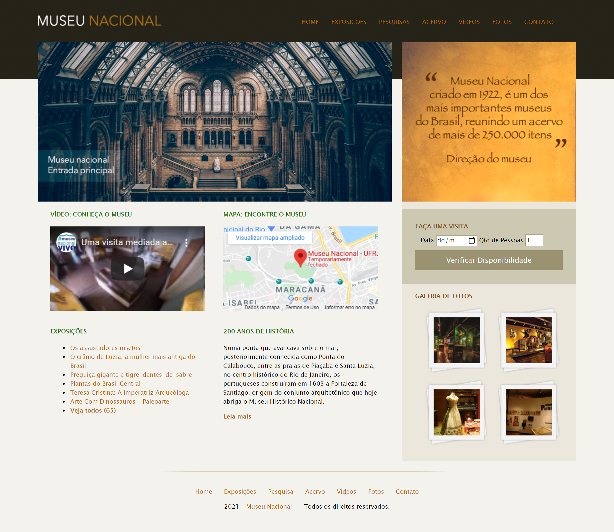

<h1 align="center"></h1>

Landing Page de um museu criado para praticar conhecimentos em Front-End

<h1 align="center">
  
</h1>

### :dart: Objetivo

Criar uma landing page de um museu, colocando em prática conhecimentos adquiridos em HTML e CSS.

### :blush: Pré-requisitos

Para visualizar o site em sua máquina, você só precisa ter um navegador de sua preferência, depois de fazer o Git Clone.
Além disto é bom ter um editor para trabalhar com o código como [VSCode](https://code.visualstudio.com/)

### 🛠 Tecnologias

As seguintes ferramentas foram usadas na construção do projeto:

- HTML
- CSS

### 📜 Licença

This project could be used by anyone! MIT License

### :smiley: Autor
Feito com ❤️ por Gabriel Venancio 
